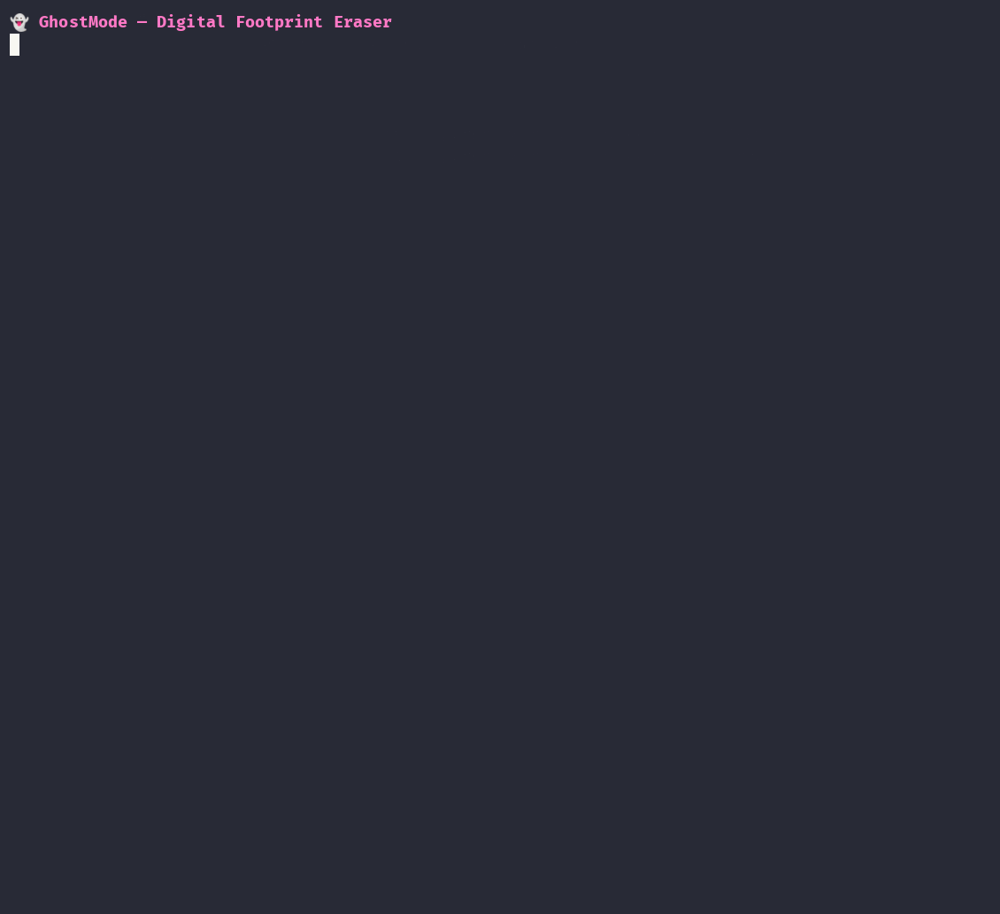

<div align="center">

# 👻 GhostMode

**Digital Footprint Eraser** — scan, review, and bulk-delete the data Google and Instagram have quietly piled up about you.


```
  ██████╗ ██╗  ██╗ ██████╗ ███████╗████████╗███╗   ███╗ ██████╗ ██████╗ ███████╗
  ██╔════╝██║  ██║██╔═══██╗██╔════╝╚══██╔══╝████╗ ████║██╔═══██╗██╔══██╗██╔════╝
  ██║  ███╗███████║██║   ██║███████╗   ██║   ██╔████╔██║██║   ██║██║  ██║█████╗
  ██║   ██║██╔══██║██║   ██║╚════██║   ██║   ██║╚██╔╝██║██║   ██║██║  ██║██╔══╝
  ╚██████╔╝██║  ██║╚██████╔╝███████║   ██║   ██║ ╚═╝ ██║╚██████╔╝██████╔╝███████╗
   ╚═════╝ ╚═╝  ╚═╝ ╚═════╝ ╚══════╝   ╚═╝   ╚═╝     ╚═╝ ╚═════╝ ╚═════╝ ╚══════╝
```

</div>

## 🎬 Demo



> Scan an account → review a color-coded report of what's still out there → confirm → watch it get erased, one curse at a time.

---

## 🔍 The Privacy Problem

You didn't read the terms of service. Nobody did. Here's the deal you actually agreed to.

### How they collect

Every interaction is an event, and every event is logged — *forever, by default*:

- **Google** records it in **My Activity**: every search, every YouTube video watched, every Map you opened, every voice command, every "OK Google."
- **Meta / Instagram** records it in **Your Activity**: every like, comment, story reply, post, search, and the metadata around every DM.

Individually, a "like" is nothing. In aggregate, across years, it's a diary you didn't know you were keeping.

### How they profile you

Raw events are just the **fuel**. The product is the **profile** built on top:

```
  your activity  ──▶  inferred interests  ──▶  ad cohorts / "audiences"
  (likes, watches,     (fitness, new parent,    (the segments advertisers
   searches, DMs)       politics, income tier)    actually pay to reach)
                              │
                              └──▶  ML training data (recommendation + ad models)
```

They don't need you to *tell* them anything. They **infer** it — your age bracket, your
politics, your health concerns, your purchasing power — from patterns in the events
above.

### How the ads happen

That profile is what gets auctioned, in milliseconds, every time a page loads. The ad
you see is the *output* of the diary. And because the system watches whether you engage,
it's a **feedback loop**: the more you interact, the sharper the profile, the more
precise the targeting, the more you interact.

### What deleting actually does (the honest part)

Here is the line GhostMode will **not** lie to you about:

- ✅ Deleting your activity removes the **source records** — the raw diary entries. That
  cuts off the *fresh fuel* and shrinks what they can show *back* to you ("here's what
  you searched in 2019").
- ❌ It does **not** untrain the models that already learned from those events, and it
  does **not** reach into the **derived / inferred** ad-profile that was computed *from*
  them. That data is a separate artifact on their servers, and the UI gives you no button
  for it.

**Think of it this way:** GhostMode cuts off the *feed*. It can't rewrite their *memory*.
That's not a flaw in the tool — it's the honest boundary of what any user-facing deletion
can do. Reclaiming the feed is still worth a great deal.

---

## ✅ What GhostMode Can / ❌ Can't Do

| ✅ Can | ❌ Can't |
| --- | --- |
| Bulk-delete your visible **Google My Activity** (~58 categories: Search, YouTube, Maps, Assistant, Play…) | Delete server-side **derived / inferred** ad-profile data |
| Bulk-delete **Instagram** likes, comments, story replies, and posts | Untrain the ML / recommendation / ad models already fed by your data |
| Turn **off** Google's activity-tracking toggles (Web & App, Location, YouTube History…) | Guarantee permanent backend erasure (only the platform controls that) |
| Unsubscribe from YouTube channels in bulk | Delete anything the platform doesn't expose in its UI |
| Scan and honestly report current state (has-data / clean) | Delete Instagram **DMs** or **delete your account** *(planned, not yet built)* |
| Run across multiple accounts, visible **or** `--headless` | Work miracles. It automates the clicks you could do by hand — just thousands of times faster |

---

## ✨ Features

- **Scan → Review → Confirm → Act.** Never deletes blind. Every run starts read-only and shows you a report first.
- **Color-coded dashboard** (and a custom color-coded selection picker) so "needs erase" vs "clean" is obvious at a glance.
- **Conservative, ban-averse pacing** — especially on Instagram, where the goal is *the account survives*, not raw speed.
- **Multi-account** — switch between several Google / Instagram logins.
- **Headless or visible** — watch it work, or run it in the background with `--headless`.
- **Local history** — a SQLite log of what was scanned and erased, stored only on your machine.
- **Real browser, no fragile APIs** — drives an actual logged-in Chromium session, because these bulk-delete flows have no clean public API.

---

## 🧩 Supported Services

| Service | Status | Coverage |
| --- | --- | --- |
| **Google** | ✅ Full | ~58 categories — Search, YouTube (history, comments, liked videos, subscriptions…), Maps, Assistant, Play; 9 tracking toggles; one-click **nuclear** delete-all |
| **Instagram** | ✅ Phase 1 | Likes, Comments, Story Replies, Posts & Media |
| Instagram DMs | 🚧 Planned | Per-thread deletion (Phase 2) |
| Instagram Account | 🚧 Planned | Gated account deletion (Phase 3) |

---

## 🚀 Installation

**Prerequisites**

- Linux (built and tested on Kali)
- **Chromium** installed at `/usr/lib/chromium/chromium` *(adjust `CHROMIUM_BIN` in `config.py` if yours differs)*
- Python **3.11+**

**Setup**

```bash
git clone https://github.com/KaulikMakwana/ghostmode.git
cd ghostmode

python -m venv .venv
source .venv/bin/activate

pip install -r requirements.txt
```

> **Optional — password autofill.** GhostMode can pre-fill the login form from a plaintext
> file at `~/Desktop/password` (`PASSWORD_FILE` in `config.py`). This is a local
> convenience only: the file **never leaves your machine**, is **never logged or printed**,
> and is **git-ignored**. Prefer to skip it? Just log in by hand when the browser opens.

---

## 🕹️ Usage

GhostMode is a CLI. The flow is always the same: **add an account → scan → delete**.

### Accounts

```bash
python main.py login add --service instagram   # opens a browser; log in (2FA supported)
python main.py login list                       # show saved accounts
python main.py login select                     # pick the active account
python main.py login delete                      # remove a saved account
```

### See what's supported

```bash
python main.py list                     # the services GhostMode implements
python main.py list --service google    # that service's full data catalog
```

### Scan & review (read-only)

```bash
python main.py dashboard --service instagram          # live scan + color report
python main.py dashboard --service google --cached    # show the last saved scan, no rescan
python main.py dashboard --service google --delete     # scan, then jump into a delete picker
```

### Delete

```bash
python main.py delete --service instagram --pick          # interactive checkbox picker
python main.py delete --service instagram --only "Likes"   # one category
python main.py delete --service google --all               # everything erasable (skips manual/stubs)
python main.py delete --service google --nuclear           # one-shot "delete ALL Google activity"
```

> `--nuclear` is **Google-only** and irreversible — it asks for explicit confirmation.

### Turn off tracking

```bash
python main.py toggle --service google    # flip Google's activity-tracking switches OFF
```

### Headless mode

The global `--headless` flag goes **before** the command and runs Chromium with no visible window:

```bash
python main.py --headless dashboard --service instagram
```

---

## 🏗️ How It Works

GhostMode drives a **real, logged-in Chromium** over the Chrome DevTools Protocol (CDP,
port `9222`) — it clicks the same buttons you would, just methodically and at scale.

- **`core/`** — browser/CDP control, the auth flow, the SQLite store, the Rich dashboard, and the custom picker.
- **`services/<name>/`** — one module per platform: a `categories.py` catalog + `deleters/` that know each page's quirks.
- **State** lives in `~/.ghostmode/` (browser profiles + scan/delete history) — outside the repo, never committed.

The design is deliberate: every operation is **scan (read-only) → show report → confirm →
act**. It never deletes before showing you what it found.

---

## ⚙️ Configuration

Key knobs live in `config.py`:

| Setting | Purpose |
| --- | --- |
| `CHROMIUM_BIN` | Path to the Chromium binary |
| `CDP_PORT` | DevTools Protocol port (default `9222`) |
| `PASSWORD_FILE` | Optional plaintext autofill file (see Installation) |
| `IG_*` pacing block | Instagram batch sizes / delays — **deliberately slow** so the account survives, not fast |

---

## 🛡️ Disclaimer

- **Deletion is irreversible.** Once it's gone, it's gone. Review the scan report first.
- Use this **only on accounts you own**. GhostMode automates actions you're already entitled to do by hand.
- Respect each platform's Terms of Service. Automating your own account is your call and your risk.
- Provided **as is**, with **no warranty** (see [LICENSE](LICENSE)).

---

## 🗺️ Roadmap

- [ ] Instagram **DMs** — per-thread deletion (Phase 2)
- [ ] Instagram **account deletion** — gated one-shot (Phase 3)
- [ ] More services

---

## 📄 License

[MIT](LICENSE) © 2026 Kaulik Makwana
